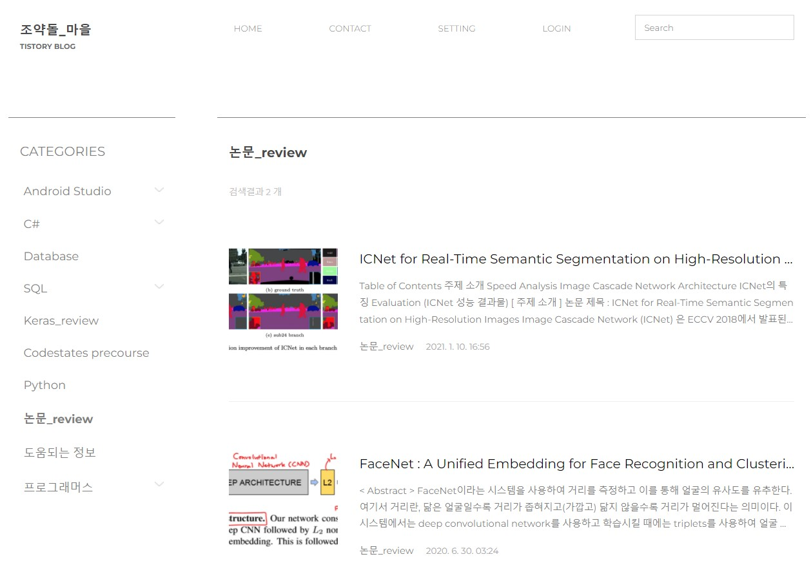

## 1. 자기 소개
[발표자료](/2260341014.pdf)  

|이름 |윤정빈|
|:---:|:---:|
|email address | binifia@gmail.com|
|skill set| C#, Java, MSSQL|
|자격증| SQLD |
|그 외| Toeic, Toeic Speaking| 

## 2. 좋아하는 노래
<iframe width="400" height="300" src="https://www.youtube.com/embed/tVtTdZt-HtI" title="YouTube video player" frameborder="0" allow="accelerometer; autoplay; clipboard-write; encrypted-media; gyroscope; picture-in-picture" allowfullscreen></iframe>

 **태연 - Blue**   
하얀 밤 아름답지만 
더 차가운 밤 오늘 
한 번만 다시 눈 맞춰줘 나를 
좀 더 
푸르게 번져가던 맘이 어느새 
시들어버린 향기가 된 채 
불러도 대답 없는 네 이름이 
메아리처럼 울려 
넌 나의 Blue 
늘 그랬듯이 
넌 나의 Blue 
그리움만 가득 채워 
번져도 아름다워 
사랑이라는 말 
너를 닮은 그 말  

## 3. 블로그
 
[티스토리 홈](https://webit22.tistory.com/)  

## 4. 목표
- [x] 나의 한계를 테스트 해보기 (어디까지 내가 해낼 수 있을지 궁금해)
- [x] 인공지능 공부
- [x] 백엔드 개발 프로젝트
- [x] 즐거운 추억 만들기
